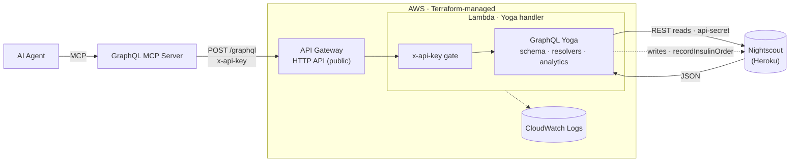

# Nightscout GraphQL Proxy

A GraphQL proxy for a Nightscout API instance, written in TypeScript and powered by GraphQL Yoga.
Runs locally as an HTTP server and deploys to **AWS Lambda + API Gateway HTTP API** (serverless,
scale-to-zero) via Terraform, so an agent — through a GraphQL MCP server — can query blood glucose
in dynamic, analytic ways.

> **Note:** this account blocks unauthenticated Lambda **Function URLs** (`AuthType=NONE` returns 403
> at the AWS layer even with a valid public resource policy — no visible SCP/RCP causes it, it's an
> account-level control). We therefore front the Lambda with a public **API Gateway HTTP API**, which
> is not subject to that block. Auth is still enforced in-app via the `x-api-key` header.

## Purpose

1. **Obscurity:** Protects the underlying Nightscout instance by hiding the direct API endpoints and potentially the instance URL.
2. **Ease of Use:** Provides a strongly-typed GraphQL schema, making it much easier for Agents and Frontends (FEs) to query only the data they need.
3. **Data Transformation & Analytics:** Converts values (e.g. exposes `mmol` alongside the raw `sgv` in mg/dL) and computes aggregates (average, time-in-range) over a window.

## Architecture



- **Reads** (entries, treatments, `glucoseStats`, `deviceStatus`, `insulinStatus`) flow left→right and back.
- **Writes** (the `recordInsulinOrder` mutation, dashed) POST a Note to Nightscout and require the
  proxy's `NIGHTSCOUT_API_SECRET`.
- The `x-api-key` gate runs **before** GraphQL executes; a bad/missing key returns `401`.

## GraphQL API

| Query | Args | Returns |
|-------|------|---------|
| `entries` | `count`, `find`, `hours`, `from`, `to` | `[Entry]` |
| `treatments` | `count`, `find`, `hours`, `from`, `to` | `[Treatment]` |
| `profiles` | – | `[Profile]` |
| `status` | – | `Status` |
| `glucoseStats` | `hours=24`, `low=70`, `high=180` | `GlucoseStats` |
| `deviceStatus` | `count=10` | `[DeviceStatus]` (incl. `pumpReservoir`) |
| `insulinStatus` | `vialUnits=1000`, `reservoirSize=200`, `batchVials=3`, `orderAtVialsRemaining=1`, `batchNoteKeyword="batch"` | `InsulinStatus` |

| Mutation | Args | Returns |
|----------|------|---------|
| `recordInsulinOrder` | `vials=3`, `note` | `InsulinOrderResult` |

### Insulin supply tracking (`insulinStatus` + `recordInsulinOrder`)

`insulinStatus` estimates home vial stock so an agent can decide whether to reorder:

- A **Note containing `"batch"`** marks a batch received (adds `batchVials × vialUnits`, default 3 × 1000 = 3000u).
- Each **`Insulin Change`** treatment (reservoir refill) draws down `reservoirSize` (default 200u).
- `orderInsulin` flips true when the estimate reaches the final vial (`estimatedVialsRemaining ≤ orderAtVialsRemaining`).
- `recordInsulinOrder` writes a tagged Note; while that tag is present since the last batch, `insulinStatus`
  reports `orderPlacedAt` and stops flagging (so an agent won't reorder every check).

> **Writes require configuration:** `recordInsulinOrder` POSTs to Nightscout, so the proxy must have
> `NIGHTSCOUT_API_SECRET` set (see `infra/terraform.tfvars`). Without it the mutation returns a
> `WRITE_NOT_CONFIGURED` error. This is a supply-tracking heuristic, not medical advice.

- **Time windows:** pass `hours: 6` for the last 6 hours, or explicit `from`/`to` ISO timestamps
  (translated to Nightscout `find[dateString][$gte|$lte]` filters).
- **`glucoseStats`** returns `count`, `averageSgv`, `averageMmol`, and `timeInRangePercent` /
  `belowRangePercent` / `aboveRangePercent` for the target range (`low`/`high` in mg/dL).

Example:

```graphql
query {
  entries(hours: 6, count: 100) { dateString sgv mmol direction }
  glucoseStats(hours: 24, low: 70, high: 180) {
    count averageMmol timeInRangePercent belowRangePercent aboveRangePercent
  }
}
```

## Local development

1. `npm install`
2. Copy `.env.example` to `.env` and fill in `NIGHTSCOUT_URL` / `NIGHTSCOUT_API_SECRET`
   (leave `PROXY_API_KEY` unset locally to skip the header check).
3. `npm run dev` → http://localhost:4000/graphql

## Deploy to AWS Lambda (Terraform)

Prereqs: AWS CLI configured (`aws configure`), Terraform ≥ 1.5.

**First deploy:**

```bash
npm run package                       # bundle + zip -> dist/function.zip
cd infra
cp terraform.tfvars.example terraform.tfvars   # fill in nightscout_url / nightscout_api_secret
terraform init
terraform apply
```

`terraform apply` prints the `graphql_endpoint` output — the URL to give clients.

**Redeploy loop:**

```bash
npm run deploy                 # rebuild + terraform apply (ROTATES the key) + print the new key
npm run deploy -- --no-rotate  # rebuild + code-only push; key UNCHANGED (fast iteration)
```

**API key rotates every deploy (by default).** The `proxy_api_key` is generated by Terraform
(`random_password`) with the code bundle's hash as its rotation trigger, so **each `npm run deploy`
mints a fresh key and invalidates the old one**. After a rotating deploy, grab the new key and update
your client / MCP config:

```bash
npm run key       # prints the current x-api-key
```

**`--no-rotate`** pushes new code via `aws lambda update-function-code` without touching Terraform's
key resource, so the current key keeps working — use it for rapid code iteration when you don't want
to re-copy a new key into your client each time. (Terraform's view of the deployed code goes briefly
stale; the next plain `npm run deploy` reconciles and rotates.)

### Auth

The endpoint is a public API Gateway HTTP API; auth is enforced **in-app** by the handler comparing
the `x-api-key` header against `PROXY_API_KEY` (constant-time). Requests without the correct key get
`401`. For a prototype, secrets live as Lambda env vars — the upgrade path is SSM Parameter Store /
Secrets Manager.

## Wiring up a GraphQL MCP server

Point any GraphQL MCP server (e.g. [`mcp-graphql`](https://github.com/blurrah/mcp-graphql)) at the
API Gateway `/graphql` endpoint (the Terraform `graphql_endpoint` output), passing the API key as a
header. Example client config:

```json
{
  "mcpServers": {
    "nightscout": {
      "command": "npx",
      "args": ["mcp-graphql"],
      "env": {
        "ENDPOINT": "https://<your-api-id>.execute-api.<region>.amazonaws.com/graphql",
        "HEADERS": "{\"x-api-key\":\"<PROXY_API_KEY>\"}"
      }
    }
  }
}
```

The MCP server introspects the schema, so the agent automatically gets the full typed query surface
(`entries` with time windows, `treatments`, `glucoseStats`, etc.).

## Project layout

```
index.ts            # local HTTP dev server
lambda.ts           # AWS Lambda handler (x-api-key gate + yoga.fetch)
build.mjs           # esbuild bundle + zip -> dist/function.zip
src/
  server.ts         # shared createYogaInstance()
  schema.ts         # GraphQL typeDefs
  resolvers.ts      # Nightscout REST calls + time-window params
  analytics.ts      # pure stats (average, time-in-range)
  types.ts          # TypeScript types
infra/              # Terraform: Lambda + API Gateway HTTP API + IAM + logs
```
