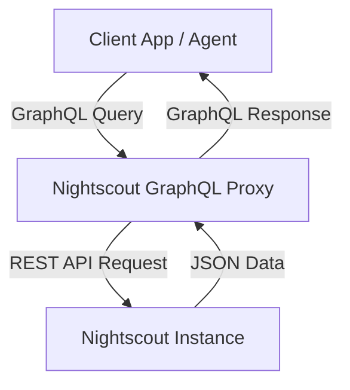

# Nightscout GraphQL Proxy

A GraphQL proxy for a Nightscout API instance, written in TypeScript and powered by GraphQL Yoga.

## Purpose

1. **Obscurity:** Protects the underlying Nightscout instance by hiding the direct API endpoints and potentially the instance URL.
2. **Ease of Use:** Provides a strongly-typed GraphQL schema, making it much easier for Agents and Frontends (FEs) to query only the data they need and interact with the Nightscout data.
3. **Data Transformation:** Automatically converts values when needed (e.g., exposing an `mmol` field alongside the raw `sgv` in mg/dL).

## Architecture



## Quick Start

1. Install dependencies:
   ```bash
   npm install
   ```

2. Create a `.env` file with your configuration:
   ```env
   NIGHTSCOUT_URL=https://your-nightscout-url.com/api/v1
   NIGHTSCOUT_API_SECRET=your_hashed_api_secret
   PORT=4000
   ```

3. Run the development server:
   ```bash
   npm run dev
   ```

4. Build for production:
   ```bash
   npm run build
   npm start
   ```

