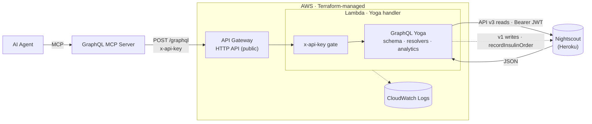

# Nightscout GraphQL Proxy

A GraphQL proxy for a Nightscout API instance, written in TypeScript and powered by GraphQL Yoga.
Runs locally as an HTTP server and deploys to **AWS Lambda + API Gateway HTTP API** (serverless,
scale-to-zero) via Terraform, so an agent — through a GraphQL MCP server — can query blood glucose
in dynamic, analytic ways.

> **Note:** this account blocks unauthenticated Lambda **Function URLs** (`AuthType=NONE` returns 403
> at the AWS layer even with a valid public resource policy — no visible SCP/RCP causes it, it's an
> account-level control). We therefore front the Lambda with a public **API Gateway HTTP API**, which
> is not subject to that block. Auth is still enforced in-app via the `x-api-key` header.

## Purpose

1. **Obscurity:** Protects the underlying Nightscout instance by hiding the direct API endpoints and potentially the instance URL.
2. **Ease of Use:** Provides a strongly-typed GraphQL schema, making it much easier for Agents and Frontends (FEs) to query only the data they need.
3. **Data Transformation & Analytics:** Converts values (e.g. exposes `mmol` alongside the raw `sgv` in mg/dL) and computes aggregates (average, time-in-range) over a window.

## Architecture


```mermaid
flowchart LR
    Agent["AI Agent"] -->|MCP| MCP["GraphQL MCP Server"]

    subgraph AWS["AWS · Terraform-managed"]
        direction TB
        APIGW["API Gateway<br/>HTTP API (public)"]
        subgraph LAMBDA["Lambda · Yoga handler"]
            direction TB
            GATE["x-api-key gate"]
            YOGA["GraphQL Yoga<br/>schema · resolvers · analytics"]
            GATE --> YOGA
        end
        LOGS[("CloudWatch Logs")]
        APIGW --> GATE
        LAMBDA -.-> LOGS
    end

    MCP -->|"POST /graphql<br/>x-api-key"| APIGW
    YOGA -->|"API v3 reads · Bearer JWT"| NS[("Nightscout<br/>(Heroku)")]
    YOGA -.->|"v1 writes · recordInsulinOrder"| NS
    NS -->|JSON| YOGA
```

- **Reads** (entries, treatments, `glucoseStats`, `deviceStatus`, `insulinStatus`) flow left→right and back.
- **Writes** (the `recordInsulinOrder` mutation, dashed) POST a Note to Nightscout and require the
  proxy's `NIGHTSCOUT_API_SECRET`.
- The `x-api-key` gate runs **before** GraphQL executes; a bad/missing key returns `401`.

### Why API v3

Reads go through Nightscout's API v3, which v1 could not do well:

| | v1 | v3 |
|---|---|---|
| Field projection | none — full documents | `fields=date,sgv` — **~7x smaller** (33 KB vs 234 KB per 1000 readings) |
| Pagination | `count` cap only | `limit` + `skip` |
| Filtering | `find[field][$op]` raw Mongo syntax | `field$op` generic syntax |
| Auth | none on this instance | subject token → JWT, required |

Three v3 quirks the client handles:

- **`limit` is capped at 1000** per request (1001 → `400 Parameter limit out of tolerance`). This
  is *not* in the OpenAPI spec, which declares only `minimum: 1`. `v3Search` pages past it in
  concurrent waves — 20 days of 1-minute readings (~24k docs) takes ~2s.
- **v3 sorts oldest-first**; v1 returned newest-first. Every read passes `sort$desc` on the
  collection's own date field so `count: 1` still means "the latest one".
- **There is no `_id`.** v3 renames it `identifier` on every collection, so the schema exposes
  `identifier`. A field kept as `_id: ID!` resolves to null and, being non-null, nulls out the
  whole element — which is how `treatments` and `profiles` came back as a list of `null`s.

Nightscout's own docs live at `<your-site>/api3-docs/` — note the **trailing slash**, without which
it returns a bare `301` that looks like a dead link.

## GraphQL API

| Query | Args | Returns |
|-------|------|---------|
| `entries` | `count`, `find`, `hours`, `from`, `to` | `[Entry]` |
| `treatments` | `count`, `find`, `hours`, `from`, `to`, `eventType` | `[Treatment]` |
| `profiles` | `count=10` | `[Profile]` (newest first; see below) |
| `status` | – | `Status` |
| `glucoseStats` | `hours=24`, `low=70`, `high=180` | `GlucoseStats` |
| `mealLogging` | `days=30`, `pairWindowMinutes=15`, `timezone` | `MealLogging` (see below) |
| `deviceStatus` | `count=10` | `[DeviceStatus]` (pump **and loop**: `iob`, `cob`, see below) |
| `insulinStatus` | `vialUnits=1000`, `reservoirSize=200`, `batchVials=3`, `orderAtVialsRemaining=1`, `batchNoteKeyword="batch"` | `InsulinStatus` |

| Mutation | Args | Returns |
|----------|------|---------|
| `recordInsulinOrder` | `vials=3`, `note` | `InsulinOrderResult` |

### Device status: the loop's own arithmetic

`deviceStatus` used to expose only the pump half of each document. AAPS also
uploads what the loop computed, in an `openaps` section, and that is now mapped:

| Field | Source | Meaning |
|---|---|---|
| `iob` | `openaps.iob.iob` | Insulin on board, units. A bolus keeps acting for the profile's `dia` (5 h here). |
| `basalIob` | `openaps.iob.basaliob` | The basal share of it; negative after basal has been suppressed. |
| `insulinActivity` | `openaps.iob.activity` | How fast that insulin is acting, u/min. |
| `cob` | `openaps.suggested.COB` | Carbs on board, grams. What was *logged*, not what was eaten. |
| `sensitivityRatio` | `openaps.suggested.sensitivityRatio` | Autosens multiplier; 1.0 is the profile as configured. |
| `eventualGlucose` | `openaps.suggested.eventualBG` | Where the loop expected it to settle, mg/dL. |
| `insulinRequired` | `openaps.suggested.insulinReq` | Units the loop wanted on that pass and then acted on itself. |
| `loopReason` | `openaps.suggested.reason` | Its own one-line account: COB, deviation, BGI, ISF, CR, target, predictions. |
| `loopAt` | `openaps.iob.time` | When the pass ran, slightly before `created_at`. |

**Half the documents have none of it.** AAPS writes a pump-only status and a loop
status a minute or two apart, and 105 of 200 consecutive documents arrive with
`openaps: {}`. Every field above is therefore `null` on those, so a caller after
the current IOB must read several records back rather than trust the newest one.
`count=10` is usually enough; `count=1` frequently is not.

`insulinRequired` is a record of what the algorithm did for one minute's glucose,
IOB and trend. It is not a dose for a caller to relay - `doseGuidance` in the MCP
is the only place that composes these numbers into a recommendation, and it shows
its arithmetic.

### Treatments: filter by `eventType`

A looping pump buries the user's own records. Over 90 days this instance wrote 28 007
treatments, of which **18 672 were `Temp Basal` and 7 090 were automatic `Correction Bolus`
SMBs** (every one exactly 0.70u) — the records a human entered are ~2% of the collection. A
windowed read without `eventType` therefore spends its whole `count` on machine noise: 30 days
capped at 500 records came back as **1.7 days**, containing 9 meal boluses.

`eventType` maps to v3's native `eventType$eq`, so `treatments(eventType: "Meal Bolus", hours:
2160)` returns 681 documents instead of 28 007. It is the narrow, typed replacement for what
the removed `find` argument used to allow.

Food records need one more piece of context: **a wizard bolus writes the carbs and the insulin
as two separate `Meal Bolus` documents**, a second or two apart, alongside a `Bolus Wizard`
record holding the glucose it was calculated from. Reading `carbs` off a bolus record therefore
scores nearly every meal as carb-free.

### Meal logging (`mealLogging`)

Answers "how often do meals actually get a carb entry, and when do they not" without shipping
thousands of records to the caller. It pairs each insulin-bearing `Meal Bolus` with any
carb-bearing one within `pairWindowMinutes`, and reports the rate broken down by **local** hour
of day — `timezone` defaults to the active profile store's own `timezone`, because hour-of-day
in the Lambda's UTC is meaningless for a wearer who is not in UTC.

- `loggedPercentWithWizard` vs `loggedPercentWithoutWizard` is usually the headline: on this
  instance carb entry is a side effect of taking the wizard path (50% vs 0.9%), not something
  that varies much by the clock.
- `carbEntriesWithoutBolus` catches carbs logged alone, e.g. treating a low.
- Percentages are `null`, not `0`, where the denominator is zero.

The pairing and aggregation live in `analytics.ts` as a pure function, so they are verifiable
against a fixture without a Nightscout connection.

### Profiles

A Nightscout profile document is **not** a flat settings record. It is one entry in a
profile-switch history, and the settings hang off a `store` map keyed by profile name
(`"Normal!"`, `"LocalProfile1"`, `"autosens"`), with `defaultProfile` naming the active one.
`profiles` flattens that into `stores` plus a resolved `defaultStore`.

- **Every rate is a schedule**, not a scalar: `carbratio`, `sens`, `basal`, `target_low` and
  `target_high` are arrays of `{ time, timeAsSeconds, value }` bands. Only `dia`, `carbs_hr`
  and `delay` are single numbers.
- **Each store carries its own `units`.** This pump uploads `"mmol"`, so `sens` and the
  targets are **mmol/L** — the one place in this schema that is not mg/dL.
- `carbs_hr` and `delay` only exist on profiles created inside Nightscout; pump-uploaded
  profiles omit them, as does doc-level `units`.
- The list is sorted `startDate` descending, so the settings in force now are
  `profiles[0].defaultStore`.

### Insulin supply tracking (`insulinStatus` + `recordInsulinOrder`)

`insulinStatus` estimates home vial stock so an agent can decide whether to reorder:

- A **Note containing `"batch"`** marks a batch received (adds `batchVials × vialUnits`, default 3 × 1000 = 3000u).
- Each **`Insulin Change`** treatment (reservoir refill) draws down `reservoirSize` (default 200u).
- `orderInsulin` flips true when the estimate reaches the final vial (`estimatedVialsRemaining ≤ orderAtVialsRemaining`).
- `recordInsulinOrder` writes a tagged Note; while that tag is present since the last batch, `insulinStatus`
  reports `orderPlacedAt` and stops flagging (so an agent won't reorder every check).

> **Writes require configuration:** `recordInsulinOrder` POSTs to Nightscout, so the proxy must have
> `NIGHTSCOUT_API_SECRET` set (see `infra/terraform.tfvars`). Without it the mutation returns a
> `WRITE_NOT_CONFIGURED` error. This is a supply-tracking heuristic, not medical advice.

- **Time windows:** pass `hours: 6` for the last 6 hours, or explicit `from`/`to` ISO timestamps
  (translated to Nightscout `find[dateString][$gte|$lte]` filters).
- **`glucoseStats`** returns `count`, `averageSgv`, `averageMmol`, and `timeInRangePercent` /
  `belowRangePercent` / `aboveRangePercent` for the target range (`low`/`high` in mg/dL).

Example:

```graphql
query {
  entries(hours: 6, count: 100) { dateString sgv mmol direction }
  glucoseStats(hours: 24, low: 70, high: 180) {
    count averageMmol timeInRangePercent belowRangePercent aboveRangePercent
  }
}
```

## Local development

1. `npm install`
2. Copy `.env.example` to `.env` and fill in `NIGHTSCOUT_URL` and `NIGHTSCOUT_TOKEN`
   (leave `PROXY_API_KEY` unset locally to skip the header check; `NIGHTSCOUT_API_SECRET`
   is only needed for writes).
3. `npm run dev` → http://localhost:4000/graphql

`NIGHTSCOUT_TOKEN` is a **subject token** from Nightscout's Admin Tools, not the API secret.
Give the subject the `readable` role — a wildcard role grants `crud` on every collection. Check
what a token really has:

```bash
JWT=$(curl -s "<site>/api/v2/authorization/request/<token>" | jq -r .token)
curl -s -H "Authorization: Bearer $JWT" "<site>/api/v3/status" | jq .result.apiPermissions
```

## Deploy to AWS Lambda (Terraform)

Prereqs: AWS CLI configured (`aws configure`), Terraform ≥ 1.5.

**First deploy:**

```bash
npm run package                       # bundle + zip -> dist/function.zip
cd infra
cp terraform.tfvars.example terraform.tfvars   # fill in nightscout_url / nightscout_api_secret
terraform init
terraform apply
```

`terraform apply` prints the `graphql_endpoint` output — the URL to give clients.

**Redeploy loop:**

```bash
npm run deploy                 # rebuild + terraform apply (ROTATES the key) + print the new key
npm run deploy -- --no-rotate  # rebuild + code-only push; key UNCHANGED (fast iteration)
```

**API key rotates every deploy (by default).** The `proxy_api_key` is generated by Terraform
(`random_password`) with the code bundle's hash as its rotation trigger, so **each `npm run deploy`
mints a fresh key and invalidates the old one**. After a rotating deploy, grab the new key and update
your client / MCP config:

```bash
npm run key       # prints the current x-api-key
```

**`--no-rotate`** pushes new code via `aws lambda update-function-code` without touching Terraform's
key resource, so the current key keeps working — use it for rapid code iteration when you don't want
to re-copy a new key into your client each time. (Terraform's view of the deployed code goes briefly
stale; the next plain `npm run deploy` reconciles and rotates.)

### Auth

The endpoint is a public API Gateway HTTP API; auth is enforced **in-app** by the handler comparing
the `x-api-key` header against `PROXY_API_KEY` (constant-time). Requests without the correct key get
`401`. For a prototype, secrets live as Lambda env vars — the upgrade path is SSM Parameter Store /
Secrets Manager.

## Wiring up a GraphQL MCP server

Point any GraphQL MCP server (e.g. [`mcp-graphql`](https://github.com/blurrah/mcp-graphql)) at the
API Gateway `/graphql` endpoint (the Terraform `graphql_endpoint` output), passing the API key as a
header. Example client config:

```json
{
  "mcpServers": {
    "nightscout": {
      "command": "npx",
      "args": ["mcp-graphql"],
      "env": {
        "ENDPOINT": "https://<your-api-id>.execute-api.<region>.amazonaws.com/graphql",
        "HEADERS": "{\"x-api-key\":\"<PROXY_API_KEY>\"}"
      }
    }
  }
}
```

The MCP server introspects the schema, so the agent automatically gets the full typed query surface
(`entries` with time windows, `treatments`, `glucoseStats`, etc.).

## Project layout

```
index.ts            # local HTTP dev server
lambda.ts           # AWS Lambda handler (x-api-key gate + yoga.fetch)
build.mjs           # esbuild bundle + zip -> dist/function.zip
src/
  server.ts         # shared createYogaInstance()
  schema.ts         # GraphQL typeDefs
  resolvers.ts      # query resolvers; reads via v3, writes via v1
  nightscoutV3.ts   # v3 client: JWT exchange + cache, paging, filter mapping
  analytics.ts      # pure stats (average, time-in-range)
  types.ts          # TypeScript types
infra/              # Terraform: Lambda + API Gateway HTTP API + IAM + logs
```
